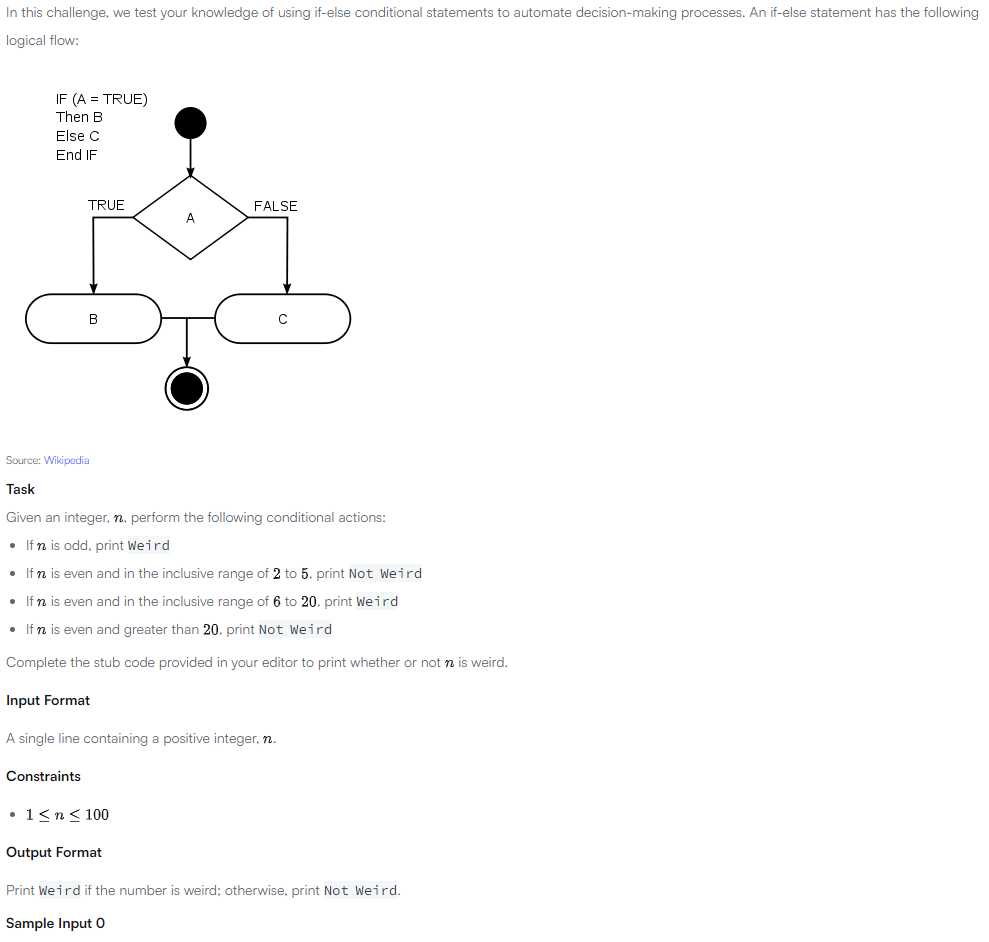

https://www.hackerrank.com/challenges/java-if-else/problem?isFullScreen=true

In this challenge, we test your knowledge of using if-else conditional statements to automate decision-making processes. An if-else statement has the following logical flow:

