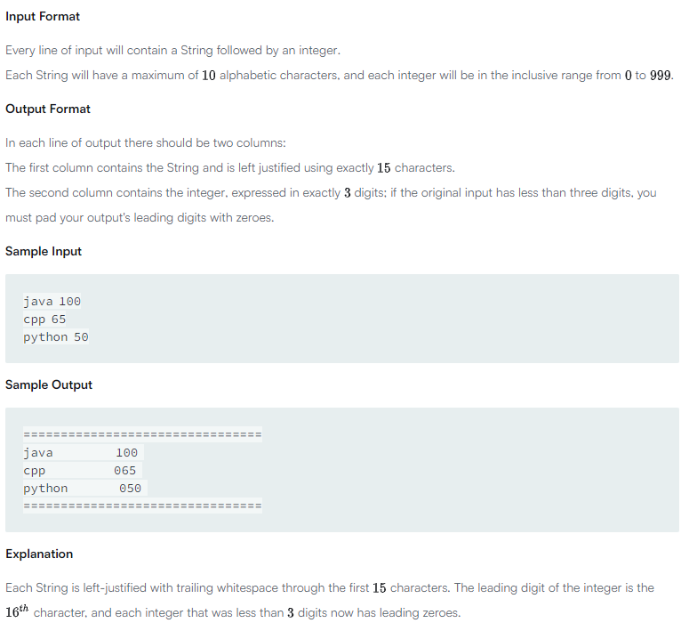

https://www.hackerrank.com/challenges/java-output-formatting/problem?isFullScreen=true
Java's System.out.printf function can be used to print formatted output. The purpose of this exercise is to test your understanding of formatting output using printf.

To get you started, a portion of the solution is provided for you in the editor; you must format and print the input to complete the solution.

